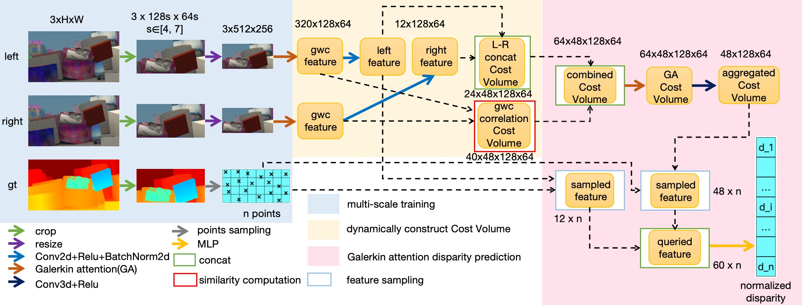

# Disparity Map Neural Operator



## Abstract
​In stereo matching, the domain adaptability of the model and the construction method of Cost Volume both play a crucial role. Therefore, Enhancing generalization capability and optimizing Cost Volume construction schemes are crucial for improving performance and practical applications.

​Mainstream models often struggle with domain adaptation due to fixed training scales and disparity search ranges, causing issues like poor generalization and unstable performance. This model introduces a novel stereo matching network structure based on neural operator, aiming to learn the mapping from the stereo image pair space to the disparity function space. Through random scale cropping, the model can learn features from different perspectives, meeting the user's requirements for testing at arbitrary scales and generating disparity maps at arbitrary resolutions.Additionally, the model can customize disparity range parameters based on dataset characteristics. To achieve training with variable scales and disparity ranges, we proposes a strategy for variable disparity step Cost Volume construction. Both strategies enhance the model's domain adaptation and generalization, better meeting the requirements of diverse application scenarios.

Traditional self-attention mechanisms face significant computational resource consumption. To address this issue, we introduces the Galerkin attention mechanism to key modules: feature extraction and 3D aggregation. Galerkin attention surpasses traditional mechanisms in memory and time efficiency. Additionally, Galerkin attention is more suitable for integration with neural operators. The innovative application of the Galerkin attention mechanism to stereo matching networks aims to enhance network performance while optimizing time efficiency to the maximum extent.

Through experiments on datasets like Scene Flow, KITTI, and Middlebury, we confirms that the proposed multi-scale training and variable disparity step Cost Volume construction significantly boosts accuracy compared to the baseline model. Additionally, the Galerkin attention mechanism improves performance on various metrics. Notably, the proposed model outperforms multiple mainstream network architectures, especially in handling large disparities or high-resolution images.

## How to use

### Environment

- Python 3.6
- Pytorch 1.2

### Install

#### Create a virtual environment and activate it

```
conda create -n DispNO python=3.6
conda activate DispNO
```

#### Dependencies

```
conda install pytorch==1.2.0 torchvision==0.4.0 cudatoolkit=10.0 -c pytorch
pip install opencv-python
pip install tensorboardx
pip install scikit-image
```

#### install deformable conv

```
cd deform_conv
python setup.py install
```

### Data Preparation

Download [Scene Flow](https://lmb.informatik.uni-freiburg.de/resources/datasets/SceneFlowDatasets.en.html), [KITTI 2012](http://www.cvlibs.net/datasets/kitti/eval_stereo_flow.php?benchmark=stereo), [KITTI 2015](http://www.cvlibs.net/datasets/kitti/eval_scene_flow.php?benchmark=stereo), [Middlebury](https://vision.middlebury.edu/stereo/)

Synthetic dataset UnrealStereo4K is created by [Fabio Tosi](https://vision.disi.unibo.it/~ftosi/), refer to Link [SMD-Nets](https://github.com/fabiotosi92/SMD-Nets) for the method of downloading this dataset.


***ATTENTION: The files with 'DispNO' in the filename represent our proposed method, while those without 'DispNO' represent the baseline model HDA-Net.***

### Train

If you want to modify the configuration, please modify the files under the folder scripts.

```
sh scripts/sceneflow_DispNO.sh
```

### Test

```
sh scripts/sceneflow_DispNO_test.sh
```

### Fine-tune

For example fine-tuning on Middlebury, you can customize the scale range and disparity range in this file.

```
sh scripts/middlebury_DispNO_range.sh
```

#### Pretrained Model

epoch:50 

[Scene Flow](https://drive.google.com/drive/folders/1vf2yShW-RyL4CYNplMKBFY8O04Z4ytDF)

## Experimental Results

Comparison between DispNO and current mainstream methods on different datasets.

### Scene Flow（test set）
<table style="text-align: center;">
	<tr>
		<td>Method</td>
		<td>EPE(px)</td>
		<td>bad1(%)</td>
	</tr>
	<tr>
		<td>GCNet</td>
		<td>1.84</td>
		<td>15.6</td>
	</tr>
	<tr>
		<td>PSMNet</td>
		<td>1.09</td>
		<td>12.1</td>
	</tr>
	<tr>
		<td>GANet-deep</td>
		<td>0.78</td>
		<td>8.7</td>
	</tr>
	<tr>
		<td>AANet</td>
		<td>0.87</td>
		<td>9.3</td>
	</tr>
	<tr>
		<td>LEAStereo</td>
		<td>0.78</td>
		<td>7.82</td>
	</tr>
	<tr>
		<td>DispNO</td>
		<td><strong>0.70</strong></td>
		<td><strong>5.39</strong></td>
	</tr>
</table>

### KITTI 2012（test set）
<table style="text-align: center;">
	<tr>
		<td rowspan="2" style="vertical-align: middle">Method</td>
		<td colspan="2">bad3(%)</td>
    <td colspan="2">bad4(%)</td>
    <td colspan="2">bad5(%)</td>
	</tr>
	<tr>
		<td>Noc</td>
    <td>All</td>
    <td>Noc</td>
    <td>All</td>
    <td>Noc</td>
    <td>All</td>
	</tr>
  <tr>
    <td>AANet</td>
		<td>1.91</td>
    <td>2.42</td>
    <td>1.20</td>
    <td>1.58</td>
    <td>0.98</td>
    <td>1.30</td>
	</tr>
  <tr>
    <td>PSMNet</td>
		<td>1.49</td>
    <td>1.89</td>
    <td>1.12</td>
    <td>1.42</td>
    <td>0.90</td>
    <td>1.15</td>
	</tr>
  <tr>
    <td>GANet</td>
		<td>1.36</td>
    <td>1.80</td>
    <td>1.03</td>
    <td>1.37</td>
    <td>0.83</td>
    <td>1.10</td>
	</tr>
  <tr>
    <td>GwcNet-gc</td>
		<td>1.32</td>
    <td>1.70</td>
    <td>0.99</td>
    <td>1.27</td>
    <td>0.80</td>
    <td>1.03</td>
	</tr>
  <tr>
    <td>RAFT-Stereo</td>
		<td>1.30</td>
    <td>1.66</td>
    <td>1.03</td>
    <td>1.32</td>
    <td>0.86</td>
    <td>1.11</td>
	</tr>
  <tr style="font-weight: bold;">
    <td style="font-weight: normal;">DispNO</td>
		<td>1.24</td>
    <td>1.58</td>
    <td>0.92</td>
    <td>1.19</td>
    <td>0.76</td>
    <td>0.98</td>
	</tr>
</table>

Pseudo color image comparison


<div style="display: flex; justify-content: center">
  <p>
    (a) Left
  </p>
</div>


<div style="display: flex; justify-content: center">
  <p>
    (b) GwcNet
  </p>
</div>


<div style="display: flex; justify-content: center">
  <p>
    (c) RAFT-Stereo 
  </p>
</div>


<div style="display: flex; justify-content: center">
  <p>
    (d) DispNO
  </p>
</div>

### Middlebury（train set）

<table style="text-align: center;">
	<tr>
		<td>Method</td>
    <td>bad2(%)</td>
		<td>bad4(%)</td>
    <td>EPE(px)</td>
    <td>A95(px)</td>
	</tr>
	<tr>
		<td>AdaStereo</td>
		<td>18.5</td>
		<td>8.90</td>
    <td>2.62</td>
		<td>8.98</td>
	</tr>
	<tr>
		<td>ACVNet</td>
		<td>9.55</td>
		<td>4.83</td>
    <td>2.96</td>
		<td>15.8</td>
	</tr>
	<tr>
		<td>RAFT-Stereo</td>
		<td>8.87</td>
		<td>5.43</td>
    <td>1.69</td>
		<td>7.06</td>
	</tr>
	<tr>
		<td>LEAStereo</td>
		<td>9.88</td>
		<td>4.42</td>
    <td>1.61</td>
		<td>4.54</td>
	</tr>
	<tr>
		<td>DispNO</td>
		<td><strong>7.66</strong></td>
		<td><strong>3.49</strong></td>
    <td><strong>1.48</strong></td>
		<td><strong>3.11</strong></td>
  </tr>
</table>

Error map comparison (threshold=2.0, white area consists of pixels with error less than threshold)

<div style="display: flex; justify-content: space-around;">
    <div style="text-align: center;">
        
        <p>(a) ACVNet</p>
    </div>
    <div style="text-align: center;">
        
        <p>(b) RAFT-Stereo</p>
    </div>
</div>
<div style="display: flex; justify-content: space-around;">
    <div style="text-align: center;">
        
        <p>(c) LEAStereo</p>
    </div>
    <div style="text-align: center;">
        
        <p>(d) DispNO</p>
    </div>
</div>

## Acknowledgement

We thank the authors that shared the code of their works. In particular:

- Xiaoyang Guo for providing the code of [GwcNet](https://github.com/xy-guo/GwcNet)
- Qi Zhang for providing the code of [HDA-Net](https://dl.acm.org/doi/abs/10.1145/3474085.3475273)
- Fabio Tosi for providing the code of [SMD-Nets](https://github.com/fabiotosi92/SMD-Nets)
- Min Wei for providing the code of [Super-Resolution-Neural-Operator](https://github.com/2y7c3/Super-Resolution-Neural-Operator)

Our work is inspired by these work.